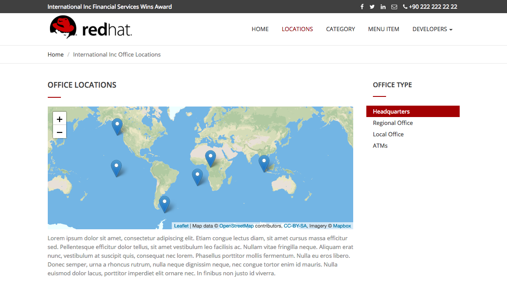

# Lab 9

## Testing the International Inc. Locations webpage

### Testing your web application

* Duration: 10 mins
* Audience: API Consumers, Developers, Architects

### Overview

This lab demonstrates the International Inc. Locations page using our newly authenticated locations API.  

### Why Red Hat?

Applications can be built from many technologies. In this case we use a simple web application, but a wide range of Red Hat and non-Red Hat technologies could be used.

### Skipping The Lab

If you decide to skip the lab you can check how a SSO enabled web applications looks like:

```bash
http://www-international.apps.GUID.openshiftworkshop.com
```

### Environment

**URLs:**

Check with your instruction the *GUID* number of your current workshop environment. Replace the actual number on all the URLs where you find **GUID**.

Example in case of *GUID* = **1234**:

```bash
https://master.GUID.openshiftworkshop.com
```

becomes =>

```bash
https://master.1234.openshiftworkshop.com
```

**Credentials:**

Your username is your asigned user number. For example, if you are assigned user number **1**, your username is:

```bash
user1
```

The password to login is always the same:

```bash
openshift
```

## Lab Instructions

### Step 1: Opening International Inc Web Page

International Inc web development create a Node.js application for the company home page. They added a map service to locate the offices around the world. In this step you will deploy that application.

1. Open a browser window and navigate to:

    ```bash
    https://master.GUID.openshiftworkshop.com/console
    ```

    *Remember to replace the GUID with your [environment](#environment) value and your user number.*

1. Accept the self-signed certificate if you haven't.

    

1. Log into OpenShift using your designated [user and password](#environment). Click on **Sign In**.

    

1. You are now in OpenShift's main page. Click on your **userX** project in the right side of the screen.

    

1. Click the Overview link, then **Routes - External Traffic** next to the **WWW** pod to open a new tab and connect to *International Inc* new website.  Append `/index.html` to the the route URL as it loads and re-load the webpage.

    

1. You should now see what the development team created for International Inc. Click **LOCATIONS** to check the locations page.

    

1. You can notice now the **Sign In** button in the page.

    


### Step 2: Test the Single Sign On Integration

1. Let's test the integration. Click the **Sign In** button.

1. You are being redirected to Red Hat Single Sign On **Login Page**. Login using the user credentials you created in the [API Security Lab](../lab04/#step-2-add-user-to-realm)

    * Username: **apiuser**
    * Password: **apipassword**

    

1. You will be redirected again to the **LOCATIONS** page where now you will be able to see the map with the International Inc Offices.

    

### Step 3: Troubleshooting the Locations Page

1. In most cases, the Locations web page will **NOT** show the locations because of a self-signed certificate issue in your web-browser.  See the below example with missing locations:

    

1. To resolve this issue in Chrome, navigate to *View > Developer > Developer Tools* menu.  A Developer Tools console should appear.

    

1. In the developer console, a red error should appear indicating a cert issue. Click on the link and accept the certificate.  

1. Refresh the page, and the locations should appear.

    

 *Congratulations!* You have successfully tested the International Inc. Locations webpage using a full SSO authenticated API.

## Steps Beyond

So, you want more? You can explore in detail the documentation on the Javascript Adapter to check what other things can you get from your authenticated user.

## Summary

In total you should now have been able to follow all the steps from designing and API, deploying it's code, issuing keys, connecting OpenID connect and calling it from an application. This gives you a brief overview of the creation and deployment of an API. There are many variations and extensions of these general principles to explore!

This is the last lab of this workshop.

## Notes and Further Reading

* [Red Hat 3scale API Management](http://microcks.github.io/)
* [Setup OIDC with 3scale](https://developers.redhat.com/blog/2017/11/21/setup-3scale-openid-connect-oidc-integration-rh-sso/)
