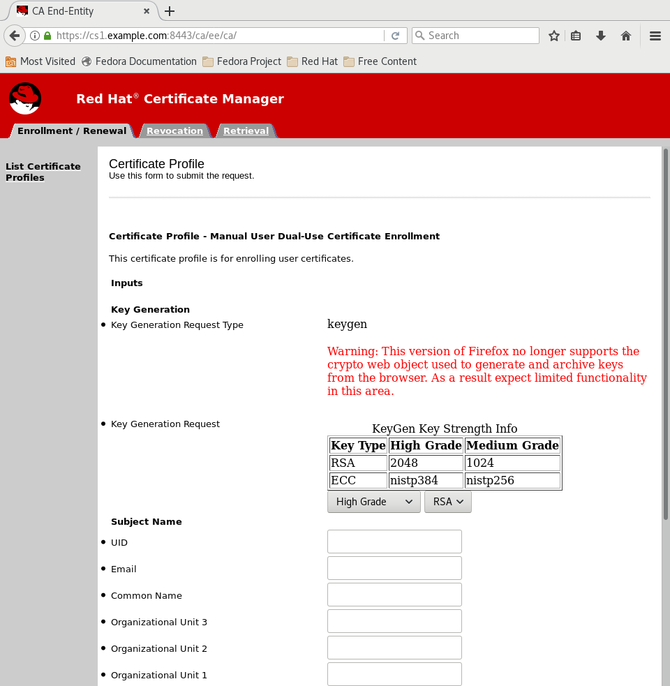
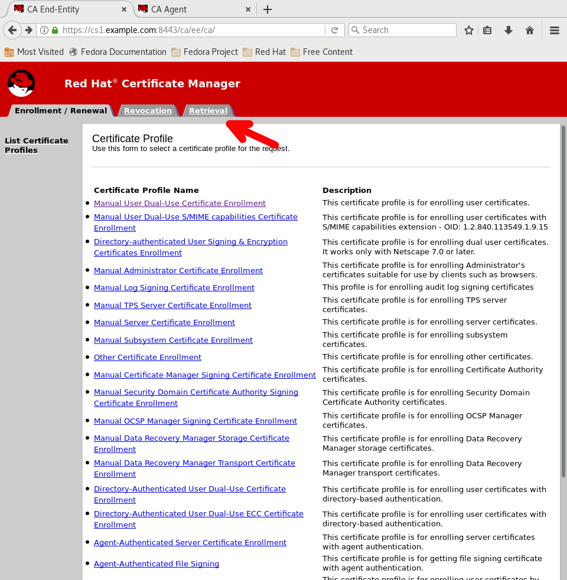
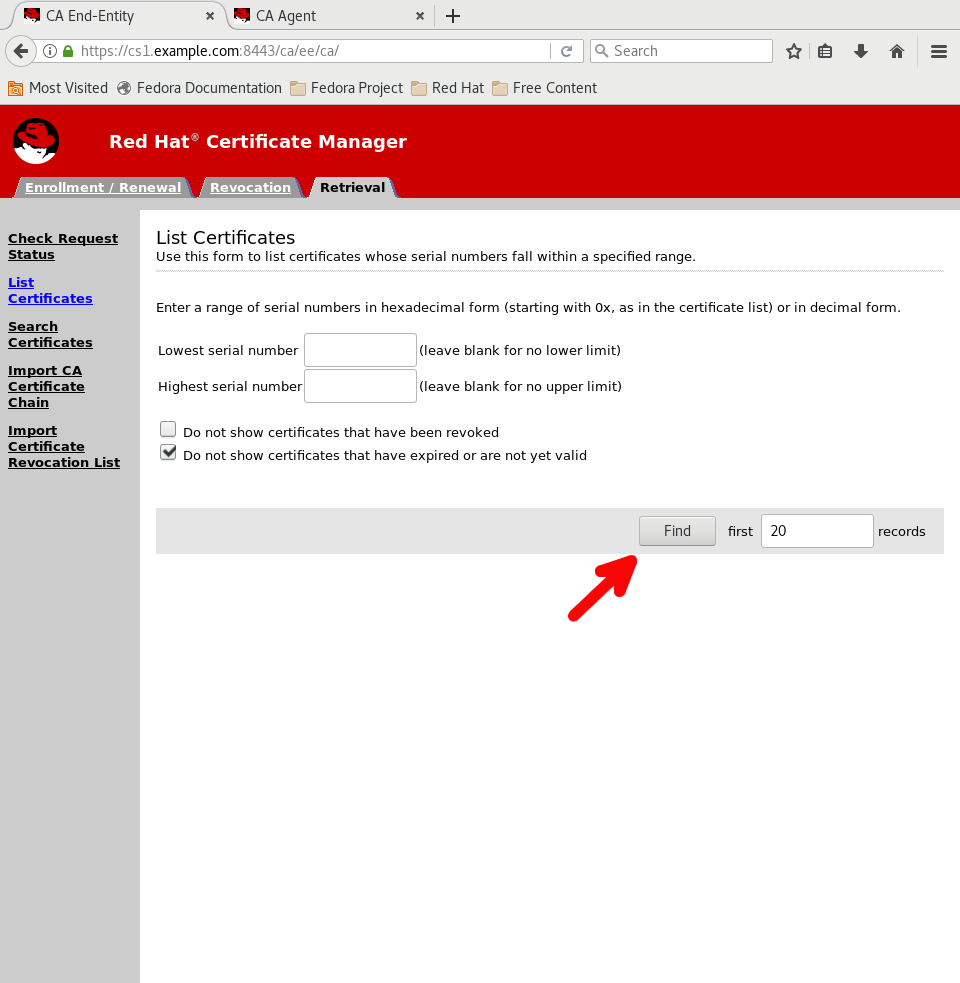

# Unit 6: Issuing a certificate

In this unit we will generate different certificates using the web interface and CLI.

The purpose of certificates is to establish trust. Their usage varies depending on the kind of trust they are used to ensure. Some kinds of certificates are used to verify the identity of the presenter; others are used to verify that an object or item has not been tampered with. 

## Certificate Request Message Format (CLI)

1. Ensure the labs were completed in Unit 5.

2. Get DRM Transport certificate serial number and store in variable.

    `trans_cert_num=$(pki -C ~/.dogtag/ca1/client_password.txt -n "PKI Administrator for redhat.example.com" ca-cert-find --name "DRM Transport" | grep "Serial Number" | awk '{print $3}')`

3. Save DRM Transport certificate into file.

    `pki -C ~/.dogtag/ca1/client_password.txt -n "PKI Administrator for redhat.example.com" ca-cert-show ${trans_cert_num} --output ~/.dogtag/ca1/transport.pem`

4. Submit certificate request.

    `pki -C ~/.dogtag/ca1/client_password.txt -n "PKI Administrator for redhat.example.com" client-cert-request "UID=brian-test" --profile caDualCert --type crmf --transport ~/.dogtag/ca1/transport.pem`

5. Get pending request number.

    `cert_req_num=$(pki -C ~/.dogtag/ca1/client_password.txt -n "PKI Administrator for redhat.example.com" cert-request-find | grep -B2 "Request Status: pending" | grep "Request ID:" | awk '{print $3}')`

6. Approve request.

    `pki -C ~/.dogtag/ca1/client_password.txt -n "PKI Administrator for redhat.example.com" ca-cert-request-review ${cert_req_num} --action approve`

7. Show approved certificate.

    `pki -C ~/.dogtag/ca1/client_password.txt -n "PKI Administrator for redhat.example.com" ca-cert-show ${cert_req_num} --pretty`

8. Remove DRM Transport certificate.

    `rm ~/.dogtag/ca1/transport.pem`

## Certificate Request (Web UI)

The URL is different in the images. I'm lazy.

1. Open CA webpage.

    `https://ca1.redhat.example.com:8443/ca/ee/ca`

2. Select `PKI Administrator` certificate (if prompted).

3. Add Exception for insecure connection (if prompted).

4. Click `Manual User Dual-Use Certificate Enrollment`.

       

5. Profile page.

       

6. Fill in with your information.

        UID - brian
        Email - bgribble@redhat.com

        Requestor Name - Brian
        Requestor Email - bgribble@redhat.com
        Requestor Phone - 555-555-5555

7. Click Submit.

8. Note request ID.

       

9. Open new tab and go to CA Agent webpage.

    `https://ca1.redhat.example.com:8443/ca/agent/ca/`

10. Click Find.

       

11. Select request ID (should match step 8).

       

12. Verify information and scroll to bottom. Select `Approve Request` and `Submit`.

13. View certificate.

14. Back to first tab or this webpage.

    `https://ca1.redhat.example.com:8443/ca/ee/ca/`

15. Click `Retrieval` Tab.

       

16. Click `List Certificates`.

       

17. Click `Find`.

       

18. Click your certificate.

19. Click `Import Your Certificate`.

       

20. Your certificate is now in your browser. Same location as Admin certificate.

The next lesson is [Unit 7: Recovering a certificate](https://gitlab.consulting.redhat.com/pki/pki-workshop/blob/master/unit_lessons/unit_7.md).
