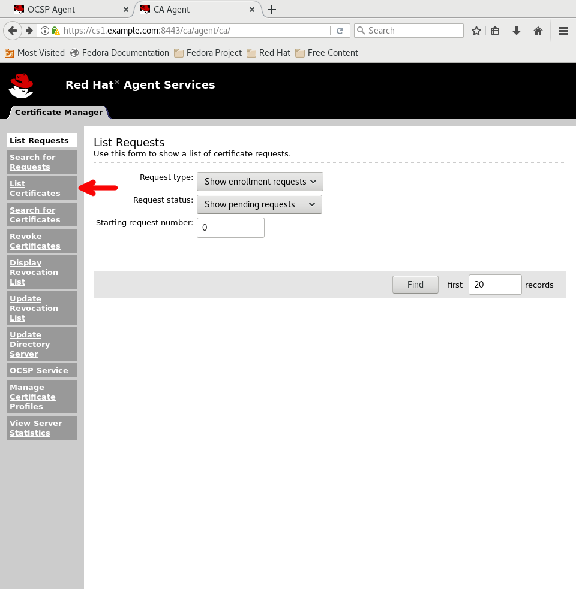
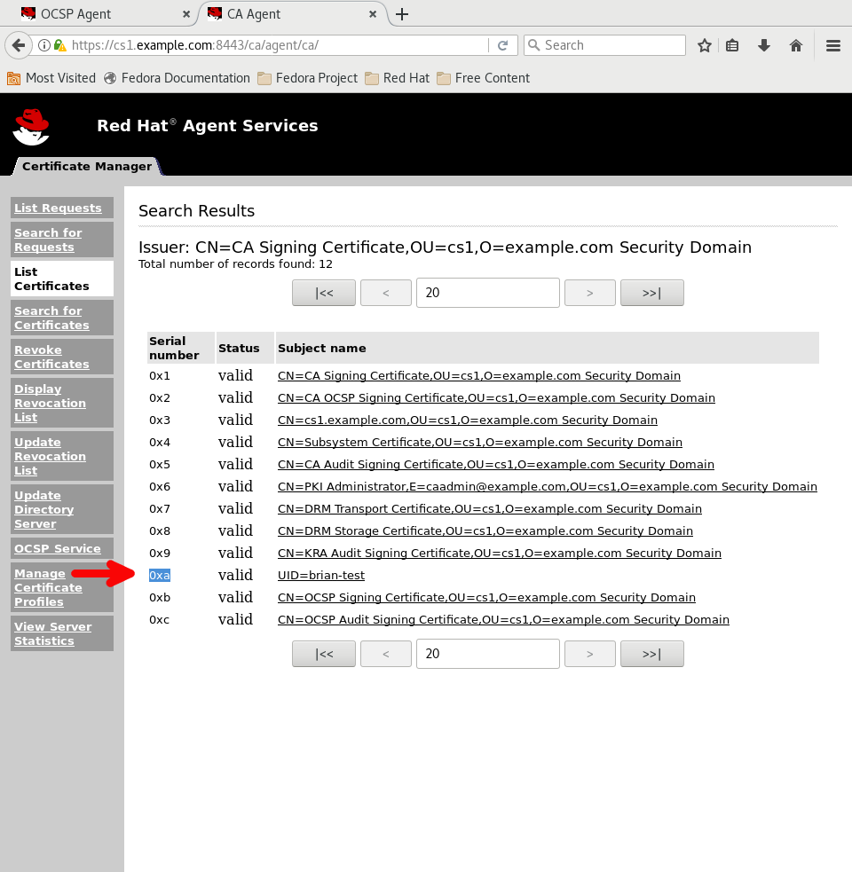
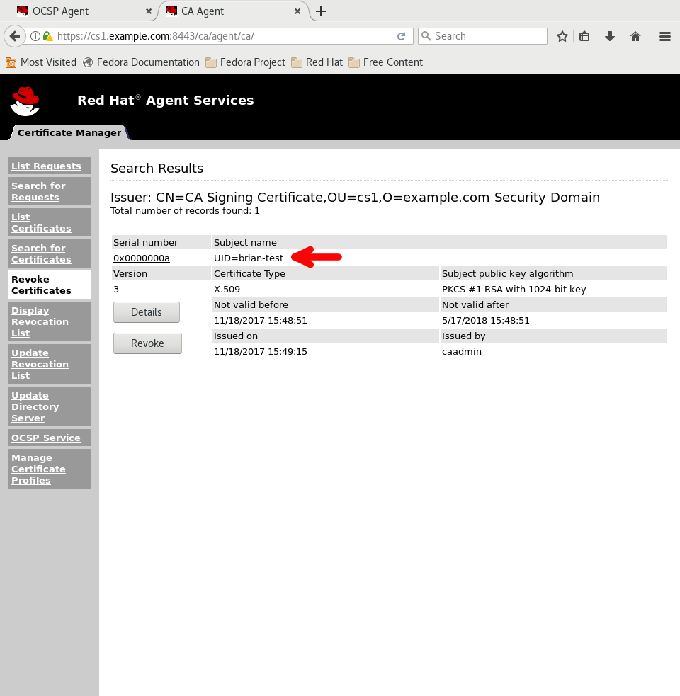
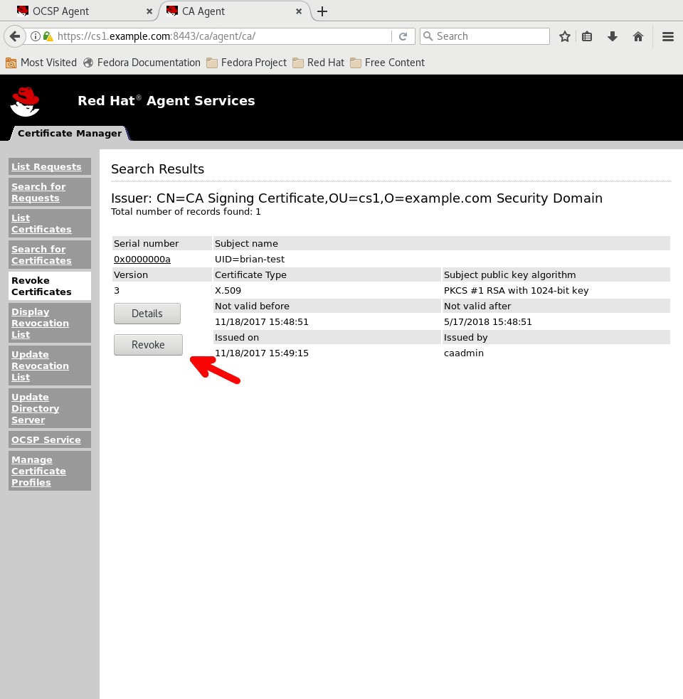
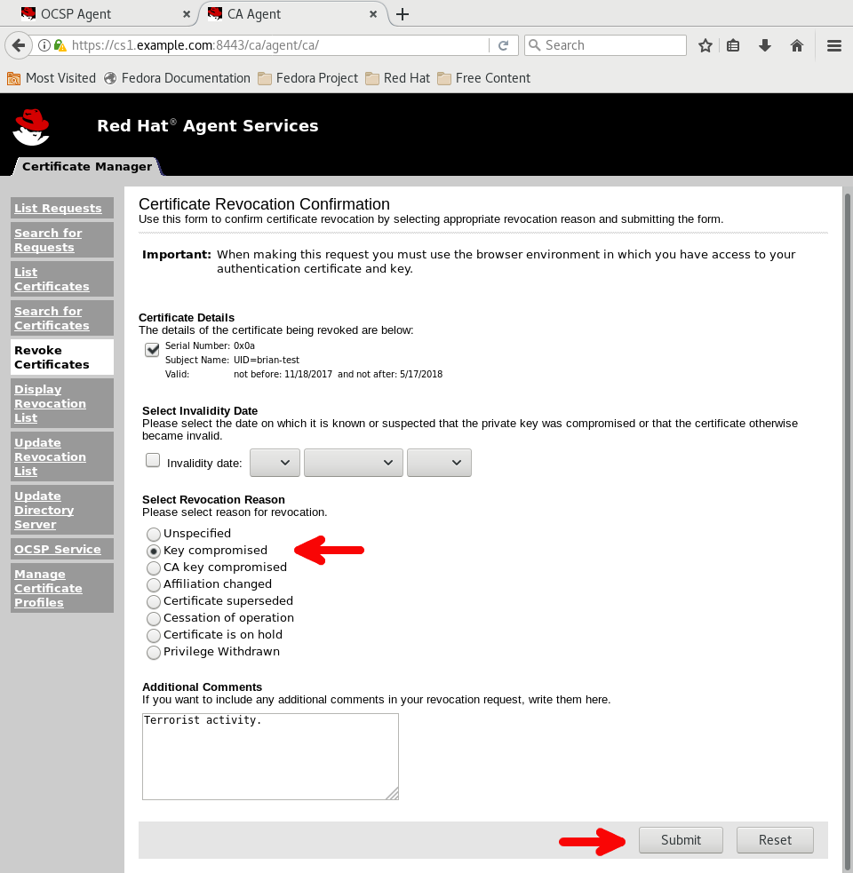
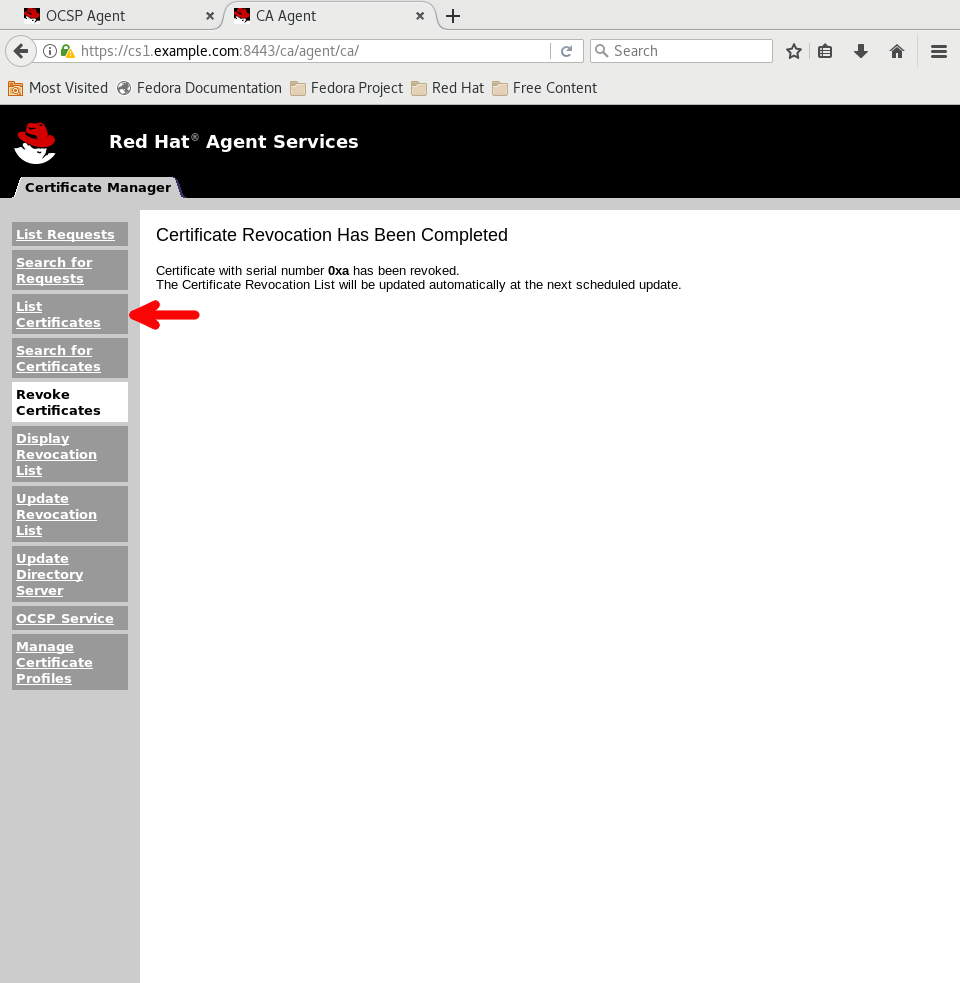
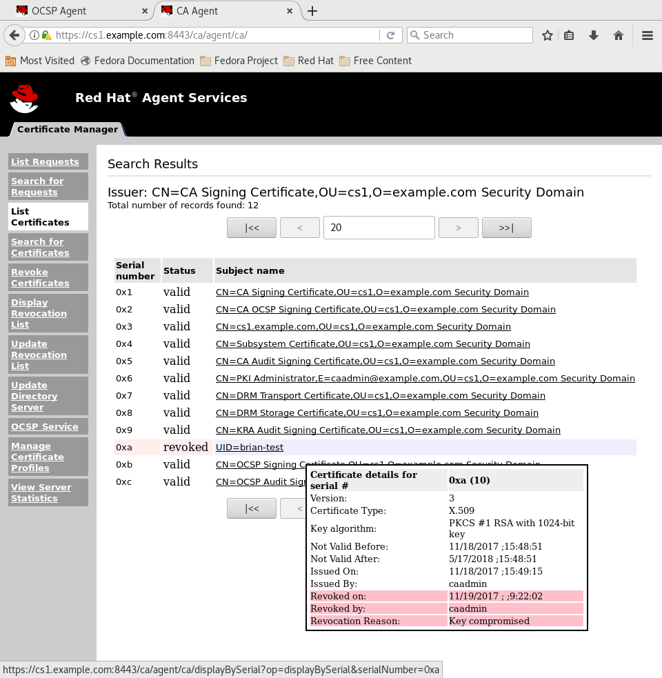

# Unit 8: Revoking a certificate

In this unit we will revoke a certificate generated during the last unit using the web interface and CLI.

## Revoke Certificate (web-based)

The URL is different in the images. I'm lazy.

1. Open CA webpage.

    `https://ca1.redhat.example.com:8443/ca/agent/ca`

2. Select `PKI Administrator` certificate (if prompted).

3. Add Exception for insecure connection (if prompted).

4. Click `List Certificates`.

       

5. Click `Find` button.
   
       

6. Copy Serial Number of `UID=` cert.

       
    
7. Click `Revoke Certificates`.

       

8. Check `Serial Number Range` box and input serial number in both boxes.

       

9. Scroll down and click `Find` button.

10. Ensure certificate is correct.

       

11. Click `Revoke` button.

       

12. Select `Key compromised` and click `Submit` button.

       

13. Click `List Certificates`.

       

14. Click `Find` button.

       

15. Hover mouse over certificate to verify revocation.

       

## Revoke Certificate (CLI)

The certificate is already removed but you can run through Unit 6 again to generate a new one.

1. Find the certificate you want to revoke. In this case it will be 0xe or 14.

    `pki -C ~/.dogtag/ca1/client_password.txt -n "PKI Administrator for redhat.example.com" ca-cert-find`

2. Revoke certificate with reason **Key_Compromise**. Other reasons can be shown with the **--help** option.

    `pki -C ~/.dogtag/ca1/client_password.txt -n "PKI Administrator for redhat.example.com" ca-cert-revoke 14 --reason Key_Compromise`

3. Check to see if certificate has been revoked.

    `pki -C ~/.dogtag/ca1/client_password.txt -n "PKI Administrator for redhat.example.com" ca-cert-show 14`

The next lesson is [Unit 9: OCSP Responder](https://gitlab.consulting.redhat.com/pki/pki-workshop/blob/master/unit_lessons/unit_9.md).
