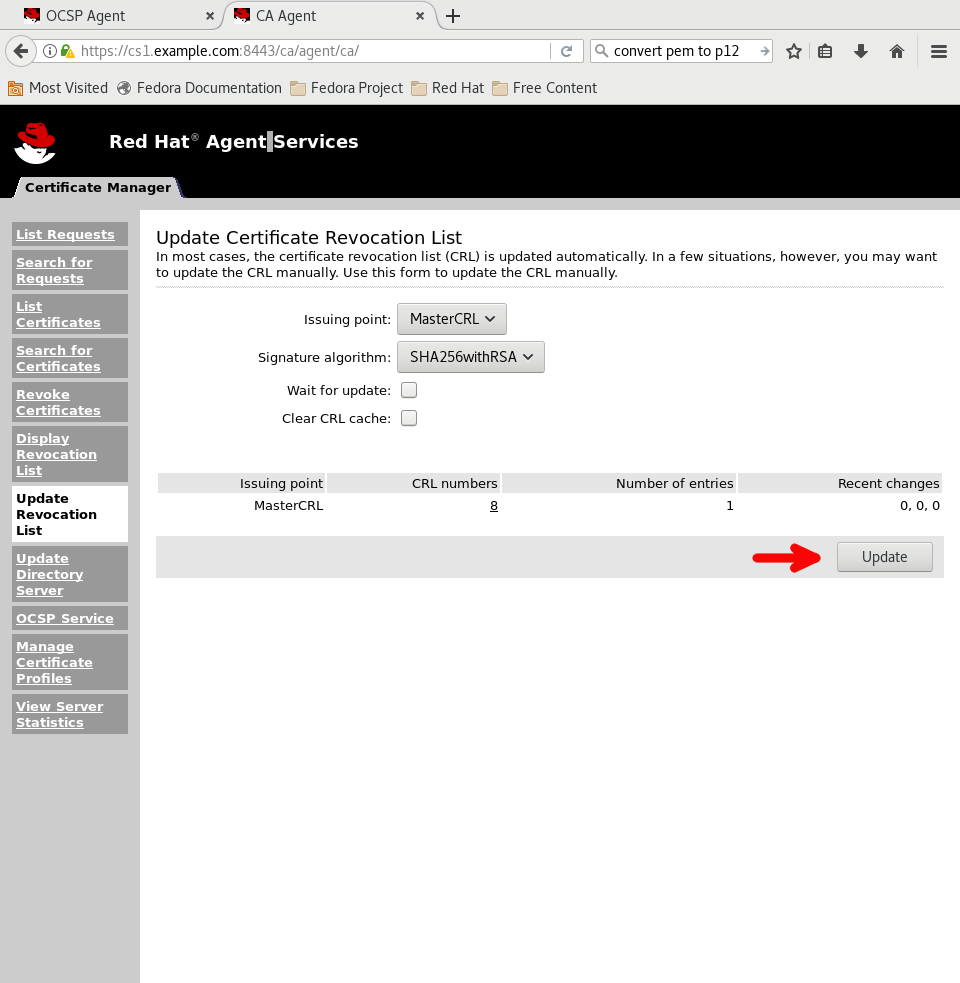
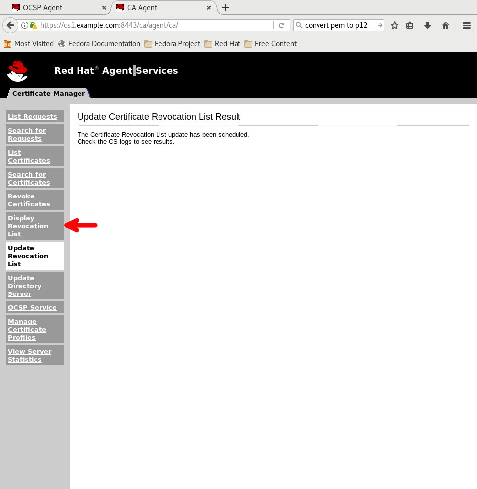
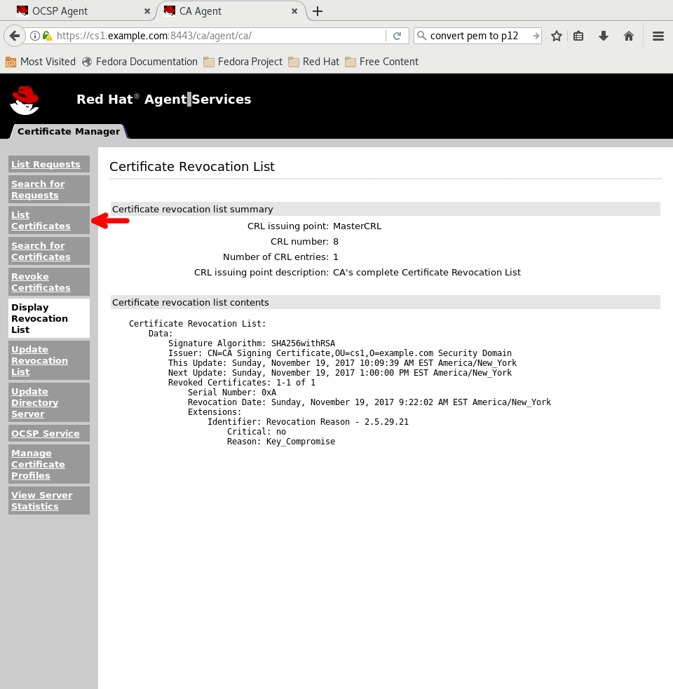
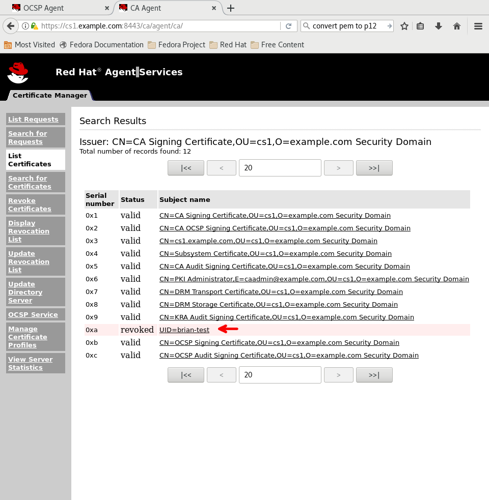
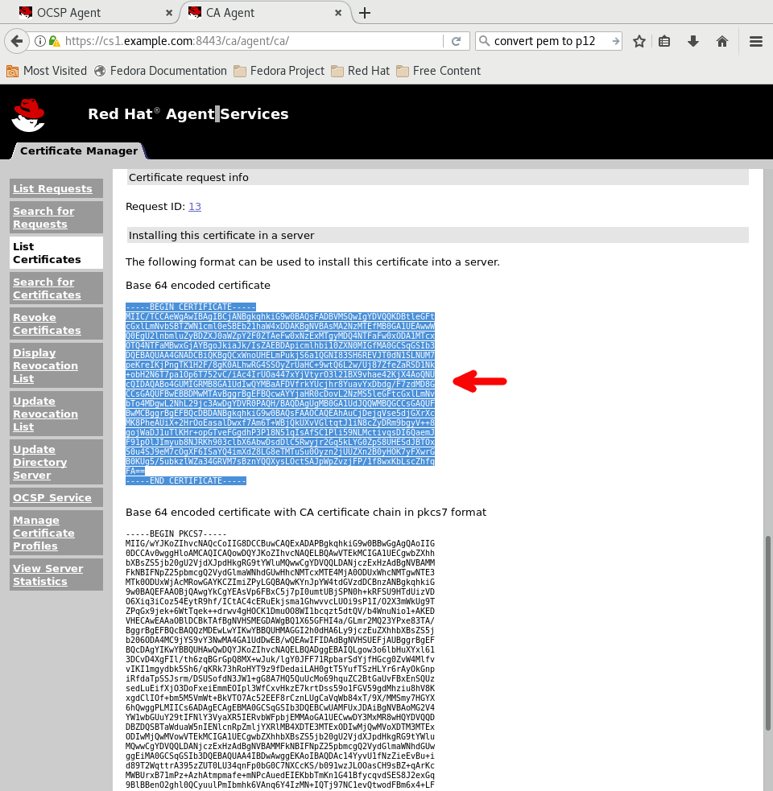
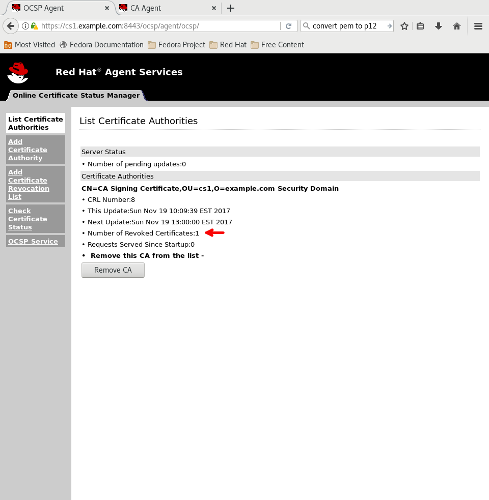
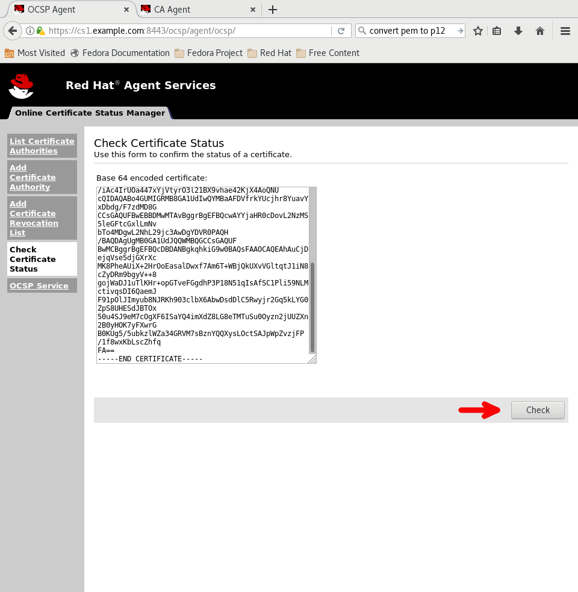

# Unit 9: OCSP Responder

In this unit you will interact with the OCSP Responder using the web interface and CLI tool **OCSPClient**. You will also issue a CRL to verify the revoked certificate is listed there.

## Check Certificate Revocation List (Web-based)

The URL is different in the images. I'm lazy.

1. Open CA webpage.

    `https://ca1.redhat.example.com:8443/ca/agent/ca/`

2. Select `PKI Administrator` certificate (if prompted).

3. Add Exception for insecure connection (if prompted).

4. Click `Update Revocation List`.

       

5. Click `Update` button.

       

6. Click `Display Revocation List`.

       

7. Click `Display` button.

       

8. Revoked certificate serial number should match.

       

9. Click `List Certificates`.

       

10. Click `Find` button.

       

11. Click revoked certificate.

       

12. Scroll down and copy `Base 64 encoded certificate`.

       

13. Open new tab and go to OCSP webpage.

    `https://ca1.redhat.example.com:8443/ocsp/agent/ocsp`

14. Notice number of revoked certificates.

       

15. Click `Check Certificate Status`.

       

16. Paste certifcate into box.

       

17. Click `Check` button.

       

18. Summary will display status as revoked.

## Check Certificate Revocation List (CLI)

1. Run OCSPClient with the **--help** option to see default entries.

    `OCSPClient --help`

2. Run OCSPClient (serial Number may be different) to view certificate status.

    `OCSPClient -d /var/lib/pki/ca1/alias -c "caSigningCert cert-ca1 CA" --serial 14`

        CertID.serialNumber=14
        CertStatus=Revoked

The next lesson is [Unit 10: Token Management System](https://gitlab.consulting.redhat.com/pki/pki-workshop/blob/master/unit_lessons/unit_10.md).
